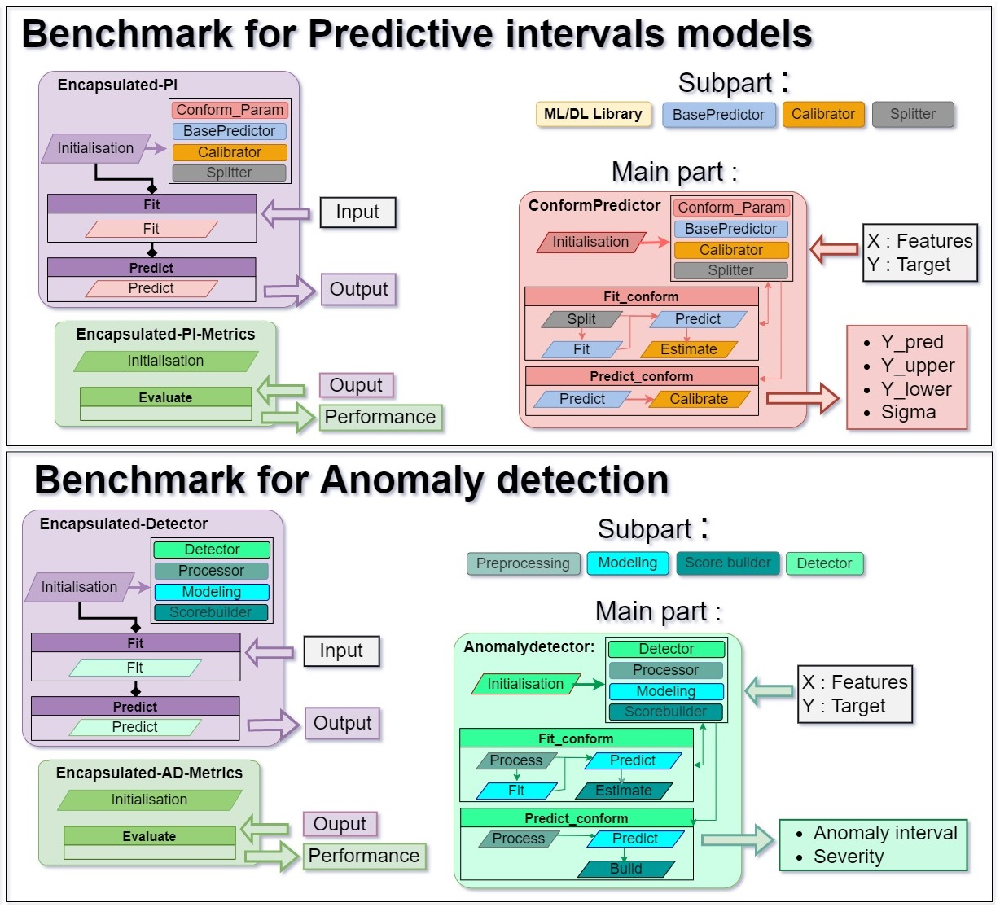

# **Abench: A Modular Benchmarking Library for Machine Learning Components**

## **Introduction**

**Abench** is a library currently under development that aims to **facilitate and partially automate the execution of machine learning benchmarks**.  
It provides **standardized pipelines** and **Abstract wrappers** to ensure reproducible, comparable, and structured evaluation of ML components (models and related modules).

The library’s philosophy is to make benchmarking **agnostic**, **reusable**, and **trustworthy**, by integrating performance metrics with metadata-driven conditional evaluations and uncertainty-aware experiment tracking.


---

## **Objectives**

Abench (previously referred to as *UQmodels*) has the following goals:

- **Standardization** — Provide a unified, consistent framework for benchmarking machine learning components.  
- **Automation** — Automate data preparation, training, evaluation, and metric computation.  
- **Trustworthiness** — Integrate *ML Trustworthiness* indicators and variability-aware evaluation schemes.  
- **Reproducibility** — Structure the benchmark as a complete, self-contained experiment folder.

The library generates:
- **Performance metrics** (e.g., accuracy, RMSE, etc.)
- **Trust metrics** (e.g., uncertainty, calibration, robustness)
- **Aggregated visualizations** across multiple experimental runs

---

## **Core Functionalities**

Minimal functional features include:

- **`DataLoader`** — Provides input data for experiments.  
- **`DataExperiment`** — Combines multiple DataLoaders to form (train, eval) dataset pairs.  
- **`Component`** — Standardized interface (`fit`, `predict`) for model training and inference.  
- **Model storage** — Save/load models and their outputs for reproducibility.  
- **Centralized API access** — Retrieve any stored data, models, outputs, or metrics.  
- **Conditional metrics execution** — Evaluate metrics through wrapper-based conditional schemes.  
- **Automated benchmark pipeline** — Executes complete benchmark loops chaining all the above functionalities.  
- **Visualization** — Tools to aggregate and visualize results.

---

## **Architecture Overview**


Abench’s architecture is organized around modular encapsulators:

1. **Dataloader** – provides data access and preprocessing  
2. **Component** – encapsulates model submodules  
3. **Modeling Pipeline** – defines data-to-output transformations  
4. **Evaluation / Visualization** – executes metrics and aggregates results

Each component is **agnostic** to task-specific logic, making Abench adaptable to various use cases.

---

## **Model Encapsulators**



The core model wrapper class is `abench.benchmark.Component`.

It provides a **generic interface** for model training and prediction:

```python
from abench.benchmark import Component
```

### **Methods**

#### `__init__(self, submodule_1=None, submodule_n=None, **kwargs)`
Initializes the encapsulated model composed of one or more submodules.

#### `fit(self, X, y, context=None, **kwargs)`
Fits the encapsulated model for a dedicated task.

#### `predict(self, X, context=None, **kwargs)`
Generates predictions using the trained model and returns a standardized `Output` object.

---

## **Metrics Encapsulators**

Metrics are handled through the class `abench.benchmark.Encapsulated_metrics`,  
which operates on model outputs generated by `Component`.

```python
metric = Encapsulated_metrics()
performance = metric.compute(output, y, sets, context)
```

---

## **Benchmark Execution**

Abench’s agnostic benchmark loop enables simple and reproducible **model comparison**.

To define a benchmark, the user specifies:
- A **model encapsulation paradigm**
- **Compatible metrics**
- **Visualization routines**

> [TODO: Provide runnable benchmark example]

---

## **Visualization**

Tools for **aggregating and displaying benchmark results**, including:
- Performance evolution
- Conditional metrics
- Variability and uncertainty visualizations

> [TODO: Add visualization examples]

---

## **Example Project: Air Liquide Demand Forecast**

> [TODO: Add example details or link to demo notebook]

---

## **Installation**

> [TODO: Add installation instructions once distributed on PyPI or GitHub]

Example:
```bash
pip install abench
```

---

## **Library Structure**

The `abench` package is organized into modular folders, each dedicated to a specific functionality in the benchmarking workflow.  
This modular design supports extensibility and ensures clear separation between data handling, model execution, evaluation, storage, and visualization.

```
abench/
├── benchmark/
│   └── benchmark.py
│       → Implements the core benchmark execution loop coordinating all modules.
│
├── component/
│   └── component.py
│       → Defines abstract and generic base classes for model encapsulation ("Components").
│
├── metric/
│   └── metric.py
│       → Defines abstract and generic base classes for metric encapsulation.
│
├── data_loader/
│   ├── data_loader.py
│   │   → Abstract and generic classes defining the AbenchDataLoader and AbenchDataExperiment interfaces.
│   │
│   ├── image/
│   │   └── dataloader_image.py
│   │       → Specialized data loader for image datasets organized in folder hierarchies.
│   │
│   └── timeseries/
│       └── dataloader_timeseries.py
│           → Specialized data loader for time series datasets.
│              Converts CSV files into multivariate sliding-window datasets for temporal learning.
│
├── visu/
│   └── visu.py
│       → Visualization utilities for aggregating and displaying benchmark results.
│
└── store/
    ├── store.py
    │   → Generic save/load functions for filesystem storage.
    │
    ├── api.py
    │   → Defines API interfaces for reading and writing Abench objects (data, models, outputs, metrics).
    │
    └── data_management/
        └── data_management.py
            → CSV data enrichment utilities for preprocessing raw tabular datasets.
```

Each subpackage can be extended independently to accommodate new data modalities, model types, or evaluation schemes.

---

## **Project Layout for a Typical Benchmark**

Abench organizes a benchmarking project as a **self-contained folder** with the following recommended layout:

```
project/
├── data/
│   └── raw/
├── src/
│   ├── descriptor.py
│   ├── perturbator.py
│   ├── dataloader.py
│   ├── component.py
│   ├── metrics.py
│   └── [TODO: additional modules]
├── benchmark.py
├── analysis.ipynb
└── results/
    ├── dataloaders/
    ├── models/
    ├── outputs/
    └── metrics/
```

> The `results/` directory is automatically created by Abench to store experiment artifacts.

## **Contributing**

Contributions are welcome!  
Please open an issue or pull request for improvements, new data loaders, or model wrappers.

> [TODO: Add contribution guidelines]

---

## **License**

> [TODO: Specify license type]

---

## **Acknowledgments**

Abench supports the development of **trustworthy AI benchmarking pipelines**, emphasizing:
- Uncertainty quantification  
- Robustness evaluation  
- Reproducible experimentation

> [TODO: Add institutional or project acknowledgments]
